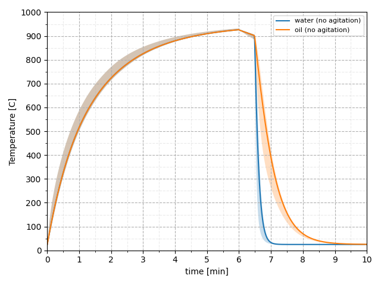

# Caso "basic heat treatment"

## Generalidades

### Descripción

Este ejemplo muestra la utilización básica del resolvedor `solid`, que permite estimar transferencia de calor en sólidos.

Se tienen cinco (5) directorios en los que presentan distintos ciclos térmicos para una pieza, cuya geometría corresponde al ejemplo `flange`, que es distribuido junto con la instalación de openFOAM.

### Correr un caso

Cada caso contiene scripts `Allclean` y `Allrun`, que contienen las instrucciones para "limpiar" y para "correr" los casos, respectivamente.

Para ejecutar los scripts, una vez que esté en el directorio de trabajo, ejecutar los siguientes comandos en la consola:

```sh
# ejecutar cuando esté dentro de alguna de las carpetas cycle##
./Allclean
./Allrun
```

En caso que no se pueda ejecutar alguno de estos scripts, se deben de cambiar los permisos haciendo en la consola:

```sh
# ejecutar cuando esté dentro de alguna de las carpetas cycle##
chmod 775 Allclean Allrun
```

## Ejemplo de utilización

Se incluyen 4 directorios, `cycle1, cycle1c, cycle2, cycle2c`, que contienen ejemplos de dos ciclos térmicos para emular tratamientos térmicos simplificados.

- Los directorios `cycle1, cycle1c` están parametrizados para emular un tratamiento térmico de temple en agua. Las propiedades termofísicas del caso `cycle1` son variables, y para el caso `cycle1c` son constantes.

- Los directorios `cycle2, cycle2c` están parametrizados para emular un tratamiento térmico de temple en aceite. Las propiedades termofísicas del caso `cycle2` son variables, y para el caso `cycle2c` son constantes.

En la gráfica debajo se comparan los resultados de las simulaciones en los directorios `cycle1` y `cycle2`. Se muestra para cada caso, la evolución del rango de temperatura (regiones rellenas) y la temperatura media (líneas continuas) de la geometría durante un ciclo térmico especificado por medio de condiciones iniciales y condiciones a la frontera.



## Mallado

Este ejemplo agrupa en un solo lugar las dos maneras de efectuar el mallado de la geometría `flange`, que se muestran en los ejemplos distribuidos junto con la instalación de openFOAM: 

- El mallado se puede efectuar mediante `ansysToFoam`, si se tiene una malla en formato `.ans`.

- El mallado se puede efectuar mediante el encadenamiento de `blockMesh`, `surfaceFeatures`, y `snappyHexMesh`, si se tiene una geometría definida en formato `.stl`.

Las geometrías, ya sea en archivo `.ans` o archivo `.stl` se encuentran dentro de la carpeta `constant/geometry`.

Para probar el uso de cualquiera de los métodos de mallado, basta con comentar/descomentar las líneas pertinentes en el archivo `Allrun` del caso de interés.

Si se quiere utilizar la utileria `ansysToFoam`, se descomenta la línea:

```sh
runAnsysToFoam constant/geometry/flange.ans 0.001
```

Si se quiere utilizar `snappyHexMesh`, se descomentan las líneas:

```sh
runApplication blockMesh
runApplication surfaceFeatures
runApplication snappyHexMesh
```

## Librería de materiales

### Estructura

La estructura del caso está pensada de tal forma que las propiedades termofísicas de distintos materiales se puedan organizar a manera de librería, en archivos individuales dentro de la carpeta `constant/materials`.

Para asignar un material específico para una simulación, basta con referenciar en el archivo `constant/physicalProperties` el material de interés. Para hacer esto se utiliza la directiva `#include`. Por ejemplo:

```c++
FoamFile
{
    format      ascii;
    class       dictionary;
    object      physicalProperties;
}
// * * * * * * * * * * * * * * * * * * * * * * * * * * * * * * * * * * * * * //

#include "materials/steel4140"
```

### Propiedades termofísicas variables

Los ejemplos de transferencia de calor conjugada `CHT` muestran generalmente casos en los que la conductividad térmica y la capacidad calorífica son constantes.

- conductividad térmica: `transport       constIsoSolid;`
- capacidad calorífica: `thermo          eConst;`

```c++
thermoType
{
    type            heSolidThermo;
    mixture         pureMixture;
    transport       constIsoSolid;
    thermo          eConst;
    equationOfState rhoConst;
    specie          specie;
    energy          sensibleInternalEnergy;
}
```

En el archivo `constant/materials/steel4140` se muestra un ejemplo en el que la conductividad térmica y la capacidad calorífica no son constantes, y se especifican por medio de tablas.

- conductividad térmica: `transport       tabulatedSolid;`
- capacidad calorífica: `thermo          eIcoTabulated;`

```c++
thermoType
{
    type            heSolidThermo;
    mixture         pureMixture;
    transport       tabulatedSolid;
    thermo          eIcoTabulated;
    equationOfState rhoConst;
    specie          specie;
    energy          sensibleInternalEnergy;
}
```

## Condiciones a la frontera

En los ejemplos se muestra la implementación de condiciones a la frontera de calentamiento/enfriamiento convectivo, que varían con la temperatura.

Esto se hace por medio de la definición de coeficientes de transferencia de calor (`h`) y temperatura ambiental (`Ta`), por medio de tablas. La implementación se puede ver en el archivo `0/T`.

```c++
generalBC
{
        type            externalWallHeatFluxTemperature;
        mode            coefficient;
        h               table
        // t[s]  h[W/(m2.K)]
        (
            // 
            (0      100)
            (360    100)
            (361     10)
            (389     10)
            (390   1400)
            (600   1400)
        );
        Ta              table
        (
            (0      1223)
            (360    1223)
            (361     298)
            (389     298)
            (390    298)
            (600    298)
        );
        kappaMethod     solidThermo;
        value           $internalField;    
}
```

